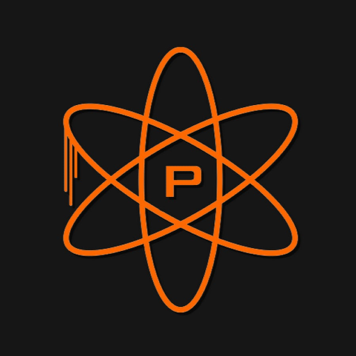

  
  <!-- Title -->
  <h1>Plutonium Animation Tool</h1>
  
  <!-- Short Description -->
  
This tool allows you to replace weapon animations to another weapon

  

## Download

- **[latest release](https://github.com/xS2RT/Plutonium-Animation-Tool/releases)**

## Discord

If you encounter any issues or have suggestions join this Discord server **[Discord](http://dsc.gg/chry)**.

## Screenshots

## Note

This tool only works with Plutonium its not built for other games, This tool might get you banned so make sure to use it in LAN mode.
